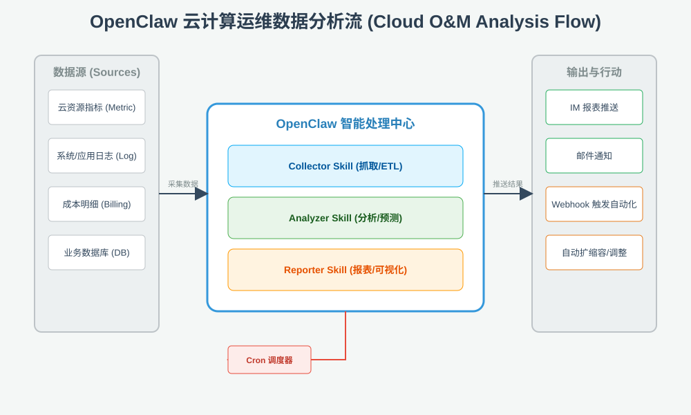

# OpenClaw 云计算运维数据分析解决方案

## 1. 概述

本方案详细介绍了如何利用 OpenClaw 强大的插件化 Skill 系统、自动化 Cron 调度以及多通道通知能力，构建一个全自动化的云计算运维数据分析平台。该平台能够实现从底层数据采集、智能化分析、到多维度报表生成的完整闭环。

## 2. 逻辑架构流



## 3. 具体 Skill 设计方案

通过编写符合 AgentSkills 标准的 `SKILL.md`，可以快速集成各类开源运维工具。

### 3.1 自动化数据采集 (Collector Skill)

- **名称**: `cloud-metric-collector`
- **核心工具**: [Prometheus](https://prometheus.io/) / [Grafana API](https://grafana.com/)
- **功能**:
  - 定时执行 PromQL 查询，抓取 CPU、内存、IO 等核心指标。
  - 自动调用云厂商 (AWS/Azure/GCP) SDK 获取资源清单。
- **示例指令**:

  ```bash
  curl -G 'http://prometheus:9090/api/v1/query' --data-urlencode 'query=avg(irate(node_cpu_seconds_total{mode="idle"}[5m])) by (instance)'
  ```

### 3.2 数据预处理与分析 (Analyzer Skill)

- **名称**: `cloud-data-analyzer`
- **核心工具**: [Pandas](https://pandas.pydata.org/) / [NumPy](https://numpy.org/)
- **功能**:
  - 对采集到的原始数据进行清洗（去除异常值、格式转换）。
  - 执行资源利用率评估和成本优化建议算法。
- **开源项目集成**: 集成 [Infracost](https://www.infracost.io/) 进行云成本预测。

### 3.3 智能报表生成 (Reporter Skill)

- **名称**: `cloud-report-gen`
- **核心工具**: [Chart.js](https://www.chartjs.org/) / [A2UI](https://docs.openclaw.ai/platforms/mac/canvas#canvas-a2ui)
- **功能**:
  - 将分析结果转化为可视化图表。
  - 利用 OpenClaw 的 **Canvas** 功能在移动端或 Web 端实时展示动态报表。

## 4. 自动化设计方案 (Automation)

### 4.1 定时任务编排 (Cron)

利用 OpenClaw 的 `cron` 子系统实现全自动运行：

```bash
# 每天早上 9 点生成昨天的资源利用率和成本分析报表
openclaw cron add \
  --name "Daily Cloud O&M Report" \
  --cron "0 9 * * *" \
  --session isolated \
  --message "抓取昨日所有集群的 CPU 利用率和账单明细，生成一份包含优化建议的 PDF 报表并发送到 Ops 频道。" \
  --announce \
  --channel slack \
  --to "channel:OPS_CENTER_ID"
```

### 4.2 数据驱动的决策行动 (Action)

当分析器检测到异常（如资源利用率持续低于 10% 或成本突增）时，触发联动：

- **IM 告警**: 实时推送卡片式消息至飞书/钉钉。
- **自动化脚本**: 触发 `webhook` 调用 Kubernetes API 自动缩减副本数。

## 5. 方案价值

- **零人工干预**: 从抓取到推送全程自动化，显著降低运维成本。
- **数据透明化**: 决策基于真实数据分析，不再依赖经验猜测。
- **闭环管理**: 实现了从“数据监控”到“自动行动”的完整链路。

---
*设计日期: 2025年1月*
