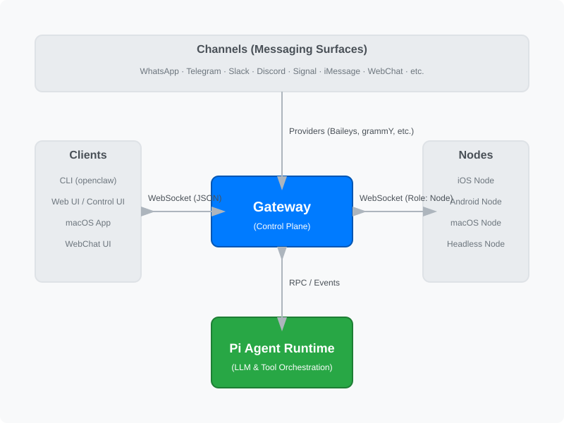
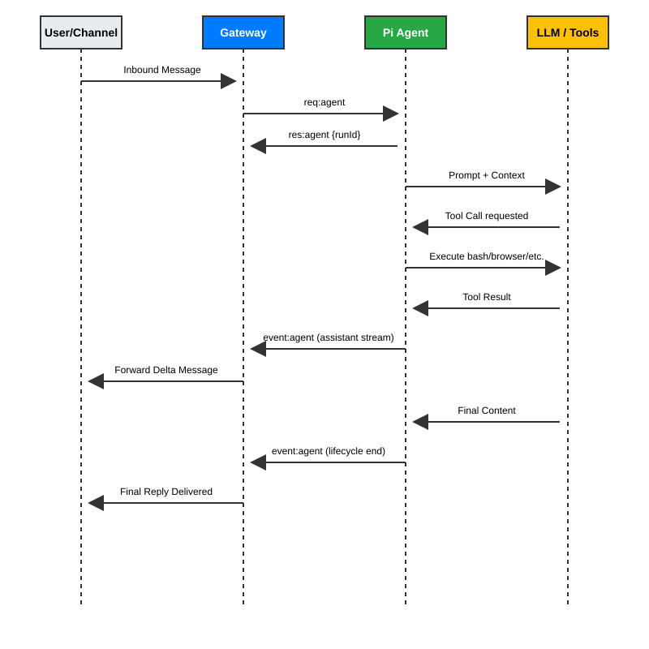
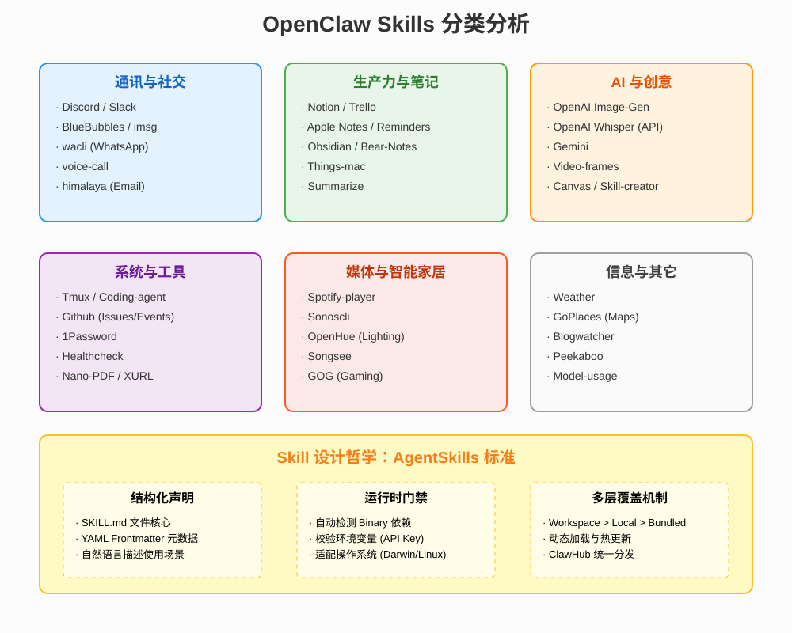

# OpenClaw 技术设计文档

## 1. 概述 (Overview)

OpenClaw 是一个个人 AI 助手平台，旨在让用户在自己控制的设备上运行 AI 助手。它通过一个统一的 **Gateway (网关)** 连接各种消息通道（如 WhatsApp, Telegram, Slack, Discord 等），并集成了强大的 **Pi Agent** 运行时，支持工具调用（如浏览器控制、终端执行等）和多模态交互。

## 2. 系统架构 (System Architecture)

OpenClaw 采用分层架构，核心是基于 WebSocket 的 Gateway 控制平面。

### 核心组件

- **Gateway (网关)**: 系统的中心节点，负责管理所有通道连接、维护会话状态、处理客户端请求和分发事件。
- **Channels (通道)**: 各种消息平台的接入层。
- **Clients (客户端)**: 用户交互界面，包括 CLI、Web UI 和桌面应用。
- **Nodes (节点)**: 运行在不同设备上的执行单元，提供硬件级功能（如摄像头、屏幕录制、系统通知）。
- **Pi Agent Runtime**: 核心 agent 逻辑，负责上下文组装、LLM 推理、工具编排和结果持久化。

## 3. 关键子系统 (Key Subsystems)

### 3.1 Gateway WebSocket 网络

Gateway 提供一个统一的 WebSocket 接口，所有客户端和节点都通过该接口进行通信。它使用 JSON Schema 进行消息校验，并支持基于设备身份的配对 (Pairing) 机制以确保安全。

### 3.2 Pi Agent 运行时

Agent 循环 (Agent Loop) 是系统的核心工作流：

1. **输入处理**: 接收消息并解析意图。
2. **上下文组装**: 结合历史消息、系统提示词、工作区文件 (AGENTS.md) 和技能 (Skills)。
3. **推理与执行**: 调用 LLM 进行决策，并根据需要执行工具。
4. **流式响应**: 实时向客户端推送中间思考过程和最终回复。

### 3.3 存储与会话管理

使用本地文件系统存储会话历史、凭据和工作区配置。每个会话都有独立的 lane，确保并发处理时的顺序性和一致性。

## 4. 关键调用流程 (Key Call Flows)

典型的端到端消息处理流程如下：

1. **消息进入**: 用户通过 Telegram 发送消息。
2. **网关处理**: Telegram Provider 接收消息并转发给 Gateway。
3. **启动 Agent**: Gateway 调用 Pi Agent 的 `agent` 方法。
4. **模型推理**: Pi Agent 组装提示词并发送给 LLM。
5. **工具执行**: 如果 LLM 决定调用工具（例如搜索网页），Agent 会在本地或沙箱中执行工具并获取结果。
6. **流式反馈**: Agent 边推理边通过 WebSocket 推送 `assistant` 流。
7. **最终交付**: Agent 完成后发送 `lifecycle: end`，网关将完整回复发送回 Telegram。

## 5. 安全模型 (Security)

- **沙箱化**: 默认情况下，工具在本地执行。对于非主会话，可以配置 Docker 沙箱运行。
- **配对机制**: 新设备连接 WebSocket 需要显式批准。
- **DM 策略**: 针对陌生人的私聊，支持配对码校验。

## 6. Skill 系统分析 (Skill Analysis)

OpenClaw 提供了丰富的内置技能，涵盖了通讯、生产力、AI 创意和系统管理等多个领域。

### 6.1 技能分类

- **通讯与社交**: 集成了 Discord, Slack, WhatsApp (wacli), iMessage (BlueBubbles) 等。
- **生产力**: 支持 Notion, Trello, Apple Notes, Obsidian 等笔记与任务管理工具。
- **AI 增强**: 提供图像生成 (DALL-E), 语音转文字 (Whisper), 以及针对 Gemini 的专用支持。
- **系统工具**: 包含终端管理 (Tmux), 编码助手 (Coding-agent), 以及 GitHub 集成。

## 7. Skill 扩展设计方案 (Skill Expansion Design)

OpenClaw 的技能系统基于 [AgentSkills](https://agentskills.io) 标准，旨在实现高度的可扩展性和零成本的技能发现。

### 7.1 设计核心：SKILL.md

每个技能都是一个独立的目录，核心是一个 `SKILL.md` 文件。该文件包含：

- **YAML Frontmatter**: 定义技能名称、描述、Emoji 以及运行依赖（Metadata）。
- **自然语言说明**: 告诉 Agent 什么时候**应该**使用该技能，什么时候**不应该**使用。
- **执行示例**: 提供具体的 shell 命令或代码片段供 Agent 参考。

### 7.2 扩展实现路径

开发者可以通过以下三种方式扩展技能：

1. **工作区技能 (Workspace Skills)**: 在 `~/.openclaw/workspace/skills` 下创建新技能，仅对当前 Agent 生效。
2. **本地技能 (Local Skills)**: 在 `~/.openclaw/skills` 下创建，对所有 Agent 可见。
3. **ClawHub 分发**: 通过 [ClawHub](https://clawhub.com) 注册并分发技能，支持一键安装和更新。

### 7.3 加载与门禁机制 (Gating)

Gateway 在加载技能时会根据 `metadata` 进行自动过滤：

- **Binary 检查**: 检查 `PATH` 中是否存在所需的执行文件（如 `curl`, `ffmpeg`）。
- **环境变量**: 校验是否配置了必要的 API Key。
- **配置项**: 确保 `openclaw.json` 中的相关开关已打开。

### 7.4 优先级策略 (Precedence)

当出现同名技能时，加载优先级如下：

`Workspace > Local > Bundled (内置)`

这种设计确保了用户可以轻松覆盖内置行为，或为特定 Agent 量身定制功能。

---
*文档生成日期: 2025年1月*
